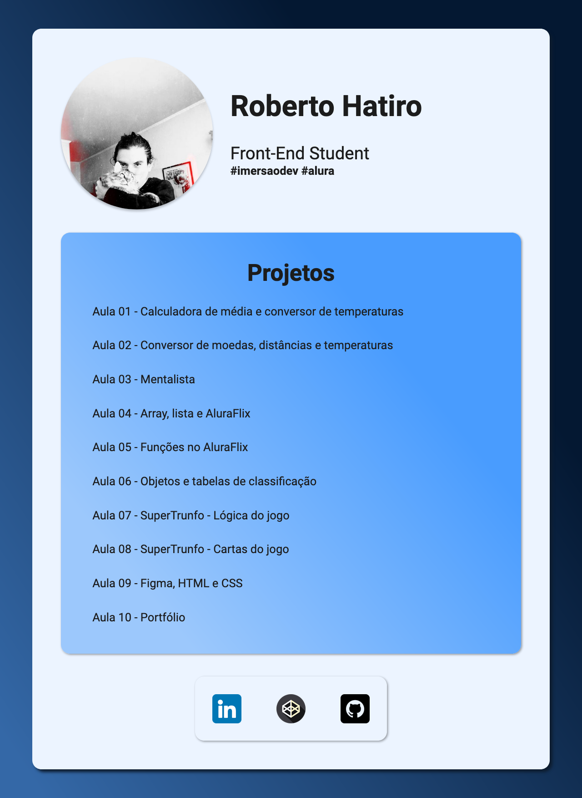

# Figma, HTML e CSS

### Screenshot



https://imersao.dev/aulas/aula09-figma-html-css

### Conteúdo detalhado desta aula:

- Aprendemos a mexer no Figma e transformar o design em código;
- Entendemos melhor como funciona HTML e CSS;
- Estruturamos o nosso portfólio com HTML, aprendendo todas as tags necessárias para isso;
- Estilizamos o nosso portfólio com CSS, conhecendo os seletores, propriedades e valores necessários para isso.

### Desafios desta aula!

- [x] Terminar todo o design que está no [figma](https://www.figma.com/file/1flmz2iauuNs8JsY6eaBHI/Imers%C3%A3o-Dev-Aula-9?node-id=0%3A1) (disponível abaixo);
      https://www.figma.com/file/1flmz2iauuNs8JsY6eaBHI/Imers%C3%A3o-Dev-Aula-9?node-id=0%3A1

- [x] Adicionar suas redes sociais de forma que quem clique consiga abri-las.

```html
<footer>
  <div class="social">
    <a target="_blank" href="https://br.linkedin.com/">
      
    </a>
    <a target="_blank" href="https://codepen.io/rhatiro">
      
    </a>
    <a target="_blank" href="https://github.com/rhatiro">
      
    </a>
  </div>
</footer>
```

A [Pen](https://codepen.io/rhatiro/pen/dyKaRza) by [rhatiro](https://codepen.io/rhatiro) on [CodePen](https://codepen.io).

[License](https://codepen.io/license/pen/dyKaRza).
